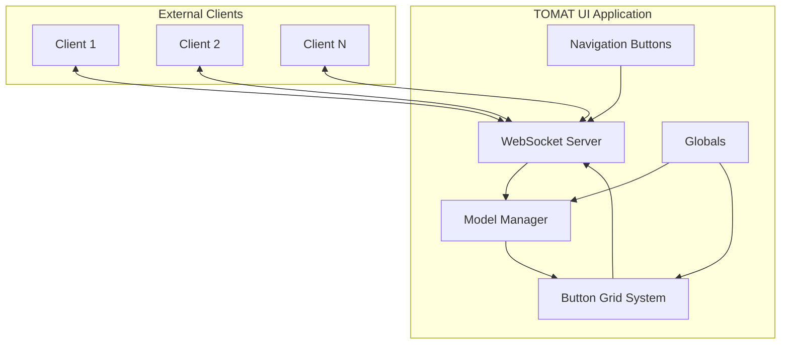
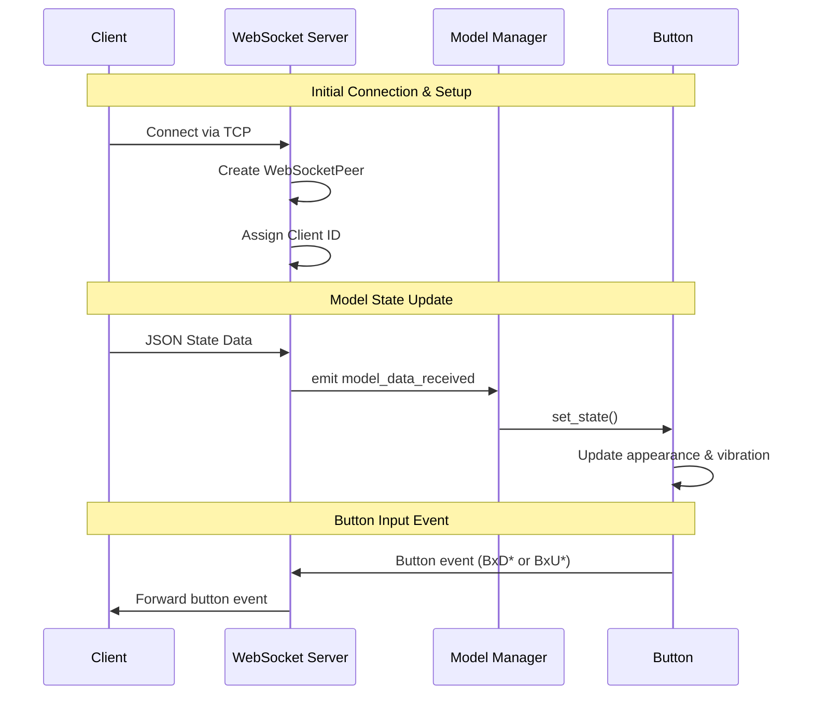
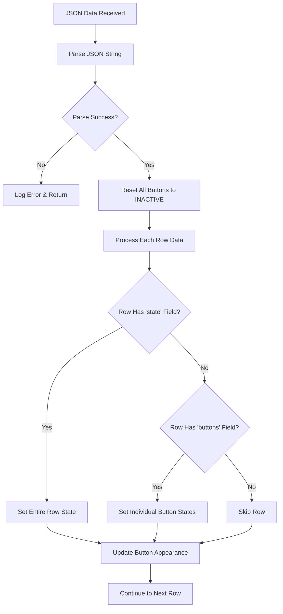
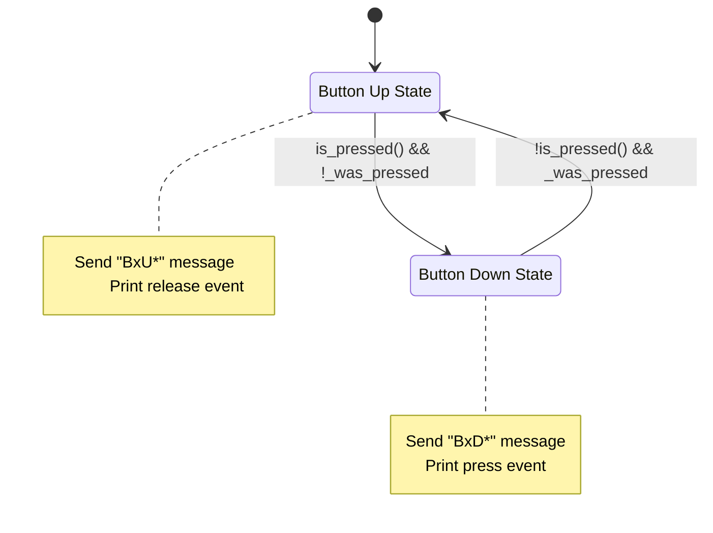
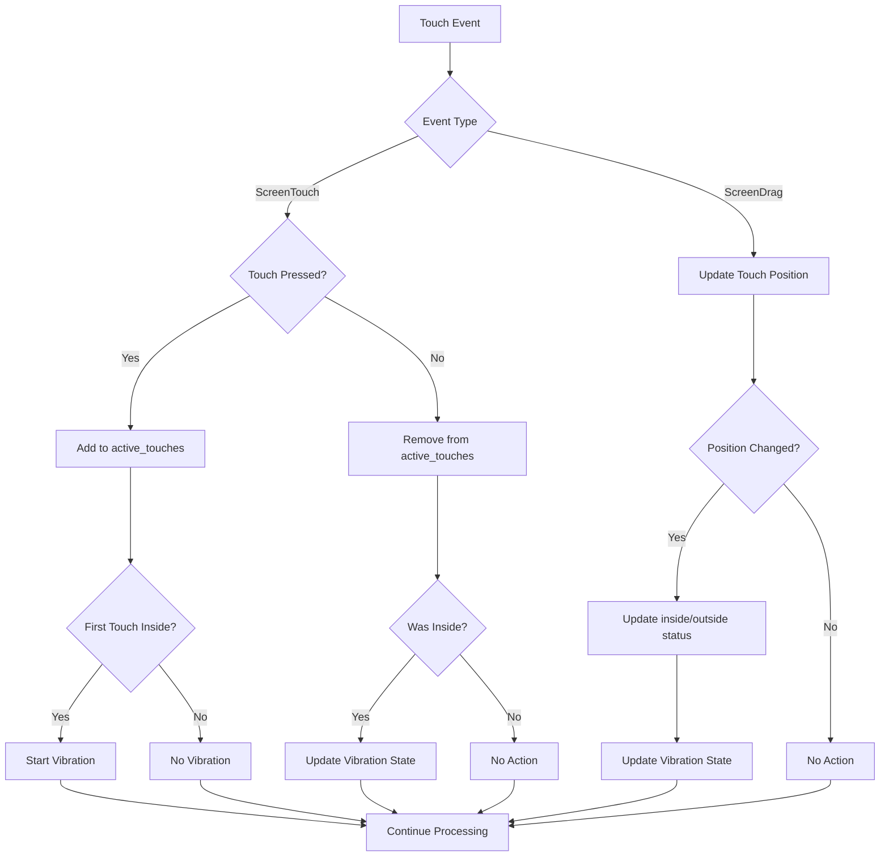
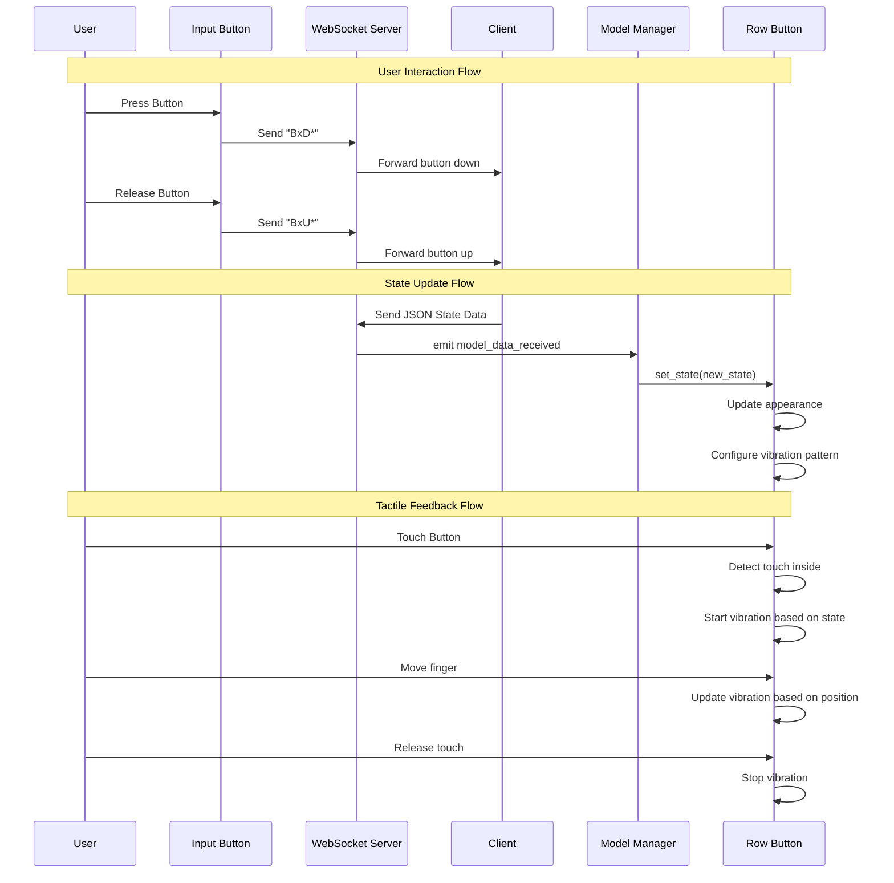
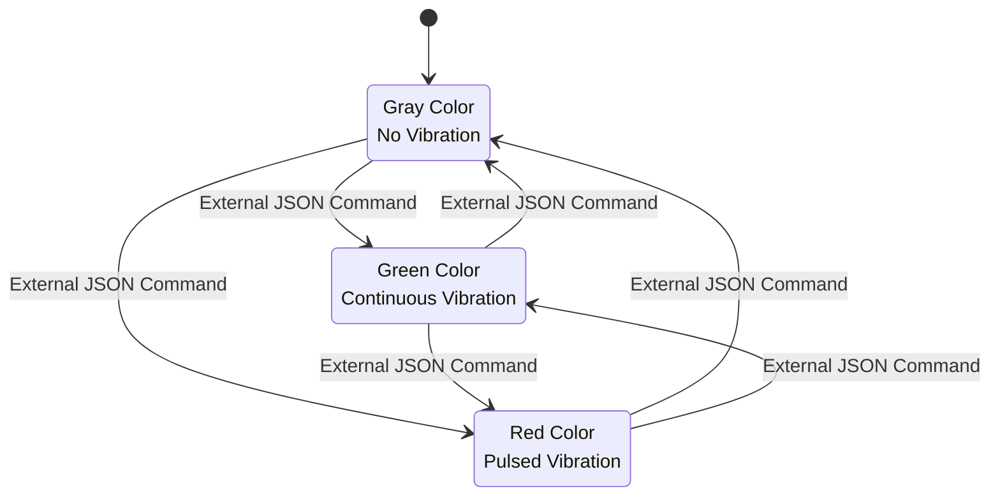

# TOMAT UI System Documentation

## Overview

The TOMAT UI system is a Godot-based application that provides a tactile interface with WebSocket communication capabilities. The system manages button states, provides haptic feedback, and communicates with external clients through WebSocket connections.

## Architecture Overview



## Component Details

### 1. WebSocket Communication System

The WebSocket server (`websocket_server.gd`) acts as the central communication hub, managing connections with external clients and facilitating bidirectional data exchange.

**Key Features:**
- Singleton pattern for global access
- Multi-client support with unique client IDs
- Automatic connection management and cleanup
- Signal-based communication with internal components



### 2. Model Manager System

The Model Manager (`model_manager.gd`) serves as the central controller that translates external state data into button behaviors and manages the overall UI state.

**State Management Process:**
The system uses a three-tier state hierarchy: INACTIVE (gray, no feedback), ACTIVE (green, continuous vibration), and PULSATING (red, pulsed vibration). When state data arrives via WebSocket, the Model Manager first resets all buttons to INACTIVE, then applies the new states according to the JSON structure.



**JSON Data Structure:**
```json
{
  "rows": [
    {
      "row": 0,
      "state": "ACTIVE"
    },
    {
      "row": 1,
      "buttons": [
        {"id": 0, "state": "PULSATING"},
        {"id": 1, "state": "ACTIVE"}
      ]
    }
  ]
}
```

### 3. Button Behavior System

The button system consists of two main types: standard input buttons (`btn_input.gd`) and row element buttons (`btn_rowElement.gd`). Each serves different purposes but both contribute to the overall tactile experience.

#### Standard Input Buttons

Standard input buttons handle basic press/release detection and communicate these events to connected clients. They track state changes frame-by-frame to ensure precise event timing.



#### Row Element Buttons

Row element buttons provide sophisticated tactile feedback based on their assigned state. They handle multi-touch input, vibration patterns, and visual state changes.

**Touch Detection System:**
The touch system tracks multiple simultaneous touches using a dictionary that maps touch indices to their inside/outside status. This allows for complex multi-finger interactions while maintaining accurate vibration feedback.



**Vibration Patterns:**

Each button state produces a distinct vibration pattern to provide clear tactile feedback:

- **ACTIVE State**: Continuous vibration with 50ms pulses every 50ms while touched
- **PULSATING State**: Complex pulsing pattern with configurable on/off durations
- **INACTIVE State**: No vibration

```mermaid
gantt
    title Vibration Patterns by State
    dateFormat X
    axisFormat %L
    
    section ACTIVE
    Continuous Vibration    :0, 400
    
    section PULSATING  
    Pulse On               :0, 200
    Pulse Off              :200, 400
    Pulse On               :400, 600
    Pulse Off              :600, 800
    
    section INACTIVE
    No Vibration           :0, 400
```



### 4. Complete Event Flow

Understanding the complete event flow helps visualize how user interactions translate into system responses and client notifications.



## State Management Deep Dive

The state management system operates on a hierarchical principle where the Model Manager maintains authoritative control over all button states. This centralized approach ensures consistency and prevents conflicting state changes.

**State Transition Logic:**

When a state change occurs, the system follows a specific sequence: first, all existing vibration patterns are immediately stopped to prevent interference; second, the visual appearance is updated to reflect the new state; finally, the new vibration pattern is configured but not started until actual touch input occurs.


